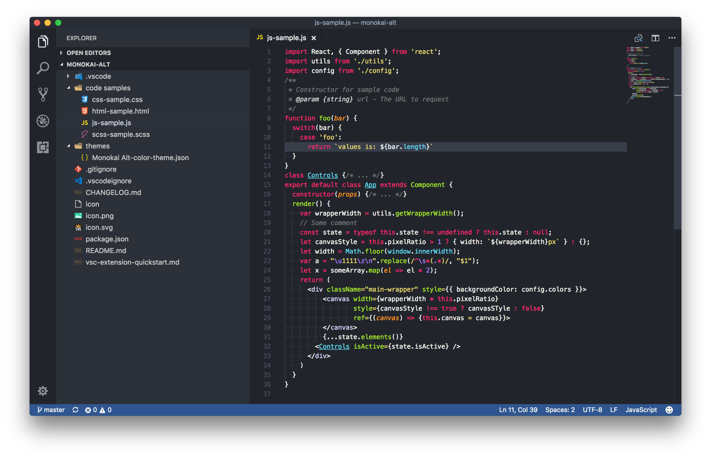
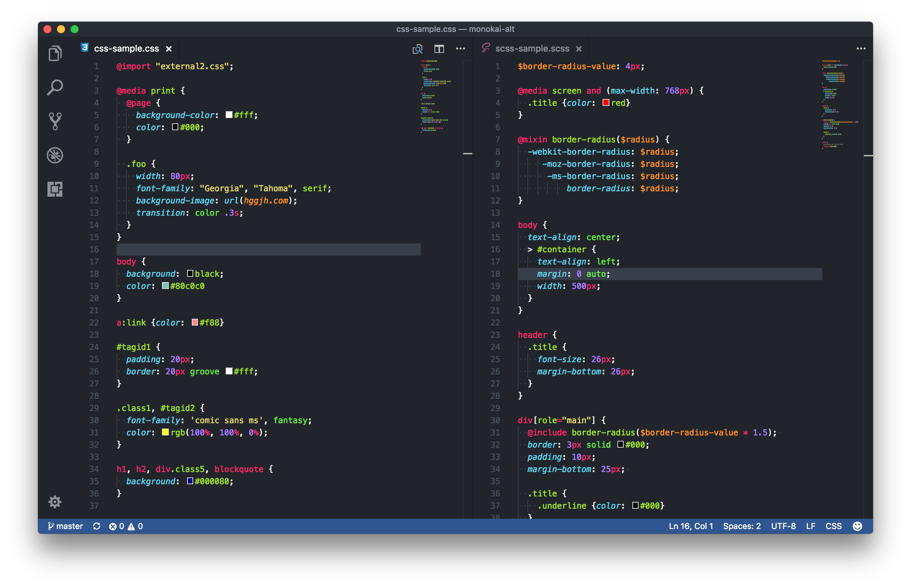
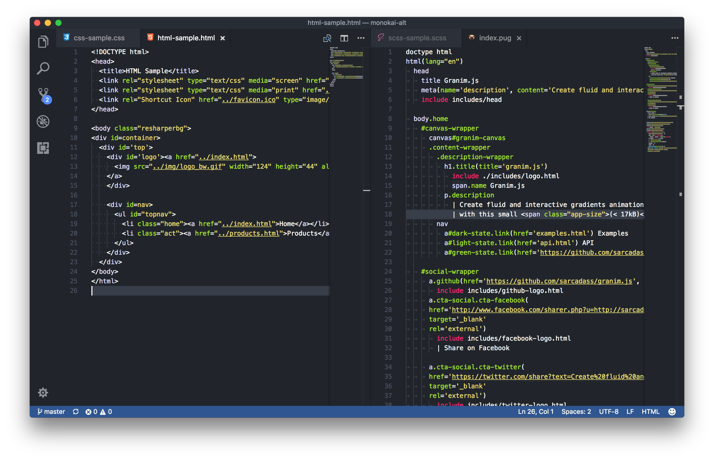

# Monokai-alt
Monokai-alt is a theme for Microsoft Visual Studio Code. It is a slightly modified Monokai theme based on my previous PhpStorm color scheme template.

This theme is based on [One Dark Flatland Monokai](https://github.com/reblws/vscode-one-dark-flatland-monokai).

## Install
Search for 'monokai-alt' in the vscode extension searchbar. Once installed, relaunch vscode then open the command palette (`ctrl/Command + Shift + p`) then type 'color theme', then choose 'Monokai Alt'.

## Screenshots
JS with menu open

CSS & SCSS

HTML & PUG

